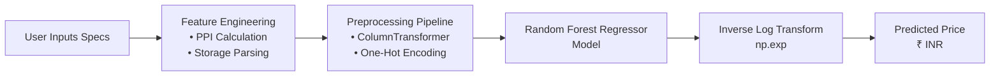

# 💻 Laptop Price Predictor

[](https://python.org)
[](https://laptop-price-predictor-jghbhbuldx2qyrx7a3scfj.streamlit.app)
[](https://scikit-learn.org)
[](https://github.com/anoopsachdev/laptop-price-predictor)

<br />

<div align="center">
  <a href="https://laptop-price-predictor-jghbhbuldx2qyrx7a3scfj.streamlit.app" target="_blank">
    
  </a>
</div>

<br />

<div align="center">

| ⚙️ Step 1: Select Hardware Specifications | 💡 Step 2: Instant Valuation Output |
| :---: | :---: |
|  |  |
</div>

<br />

A machine learning web application that estimates the market price of a laptop based on its hardware specifications. This project addresses the challenge of non-linear pricing in the electronics market by utilizing a **Random Forest Regressor** to provide accurate valuations for consumers and retailers.

---

## 📋 Table of Contents
- [Overview](#-overview)
- [Live Demo](#-live-demo)
- [System Architecture](#-system-architecture)
- [Problem Statement](#-problem-statement)
- [Dataset & Features](#-dataset--features)
- [Tech Stack](#-tech-stack)
- [Methodology](#-methodology)
- [Model Performance](#-model-performance)
- [Installation & Usage](#-installation--usage)
- [Future Scope](#-future-scope)
- [Authors](#-authors)

---

## 🚀 Overview
Buying a laptop can be confusing due to the vast number of configurations (RAM, GPU, Storage types) and their complex impact on price. This project translates technical specifications into monetary value using supervised learning. 

The final model is deployed as an interactive web app where users can input specs like **Brand**, **RAM**, **Graphics Card**, and **Screen Resolution** to get an instant price prediction.

---

## 🌐 Live Demo
You can try out the live web app directly in your browser:
👉 **[Launch Laptop Price Predictor](https://laptop-price-predictor-jghbhbuldx2qyrx7a3scfj.streamlit.app)**

---

## 🏗️ System Architecture



---

## ❓ Problem Statement
* **Lack of Transparency:** Buyers struggle to assess if a laptop is priced fairly.
* **Complex Configurations:** Manual comparison of hybrid storage (SSD+HDD), processor generations, and display panels is difficult.
* **Dynamic Market:** Prices fluctuate based on brand value and perceived performance rather than just raw hardware cost.

---

## 📊 Dataset & Features
**Source:** 1,303 Laptop configurations (`laptop_data.csv`).

### Key Feature Engineering
To improve model accuracy, extensive preprocessing was performed:
* **PPI (Pixels Per Inch):** Calculated from screen resolution and screen size to quantify display sharpness:
  $$\text{PPI} = \frac{\sqrt{X_{\text{res}}^2 + Y_{\text{res}}^2}}{\text{Screen Size (inches)}}$$
* **CPU Categorization:** Grouped dozens of processor models into 5 key categories (Intel Core i3, i5, i7, Other Intel, AMD).
* **Storage Parsing:** Extracted and separated complex hybrid storage strings (e.g., "128GB SSD + 1TB HDD") into distinct columns for SSD, HDD, Flash Storage, and Hybrid.
* **Log Transformation:** Applied to the target variable (`Price`) to normalize the right-skewed distribution.

---

## 🛠 Tech Stack
* **Language:** Python 3.8+
* **Frontend:** Streamlit
* **Machine Learning:** Scikit-Learn
* **Data Processing:** Pandas, NumPy
* **Visualization:** Matplotlib, Seaborn

---

## ⚙️ Methodology
1.  **Data Cleaning:** Handling missing values and removing units from RAM/Weight columns.
2.  **EDA:** Identifying strong correlations between Price and features like RAM, SSD capacity, and PPI.
3.  **Model Training:** A pipeline was created using `ColumnTransformer` (OneHotEncoding for categorical data) and various regression models.
4.  **Evaluation:** Models were tested on a 15% held-out test set using **R2 Score** and **MAE** (Mean Absolute Error).

---

## 📈 Model Performance
We compared four different algorithms. The **Random Forest Regressor** outperformed the others, handling the non-linear relationships best.

| Model | R2 Score | MAE |
| :--- | :--- | :--- |
| **Random Forest** 🏆 | **0.880** | **0.16** |
| XGBoost | 0.864 | 0.16 |
| Gradient Boosting | 0.836 | 0.18 |
| Linear Regression | 0.807 | 0.21 |

### Real-World Validation
The model was tested against a **Dell 16 Plus (Model 0816255)**:
* **Actual Price:** ₹72,889
* **Predicted Price:** ₹72,990
* **Accuracy:** ~99.8% on this instance.

---

## 💻 Installation & Usage
To run this project locally:

1.  **Clone the repository:**
    ```bash
    git clone https://github.com/anoopsachdev/laptop-price-predictor.git
    cd laptop-price-predictor
    ```

2.  **Install dependencies:**
    ```bash
    pip install -r requirements.txt
    ```

3.  **Run the application:**
    ```bash
    streamlit run app.py
    ```

---

## 🔮 Future Scope
* **Live Pricing:** Integration with E-commerce APIs for real-time market data.
* **Multi-Currency Support:** Support for global currencies (USD, EUR, GBP) using real-time forex exchange rates.
* **Explainability (SHAP):** Adding SHAP values to show users *why* a laptop is priced a certain way (e.g., "The OLED screen added ₹12,000 to the valuation").

---

## 👥 Authors
* **Anoop Singh Sachdev** ([@anoopsachdev](https://github.com/anoopsachdev))
* **Divnoor Singh Sahni** 

*Submitted to: Dr. Mahak Gambhir, Thapar Institute of Engineering & Technology.*
